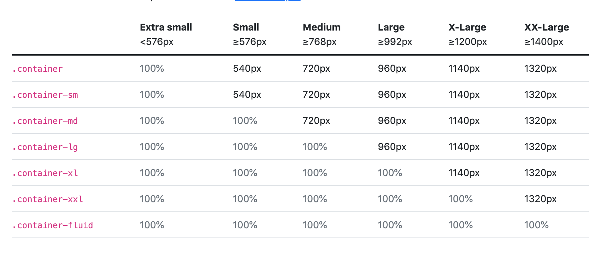

# Bootstrap

### What is Bootstrap?

Bootstrap is a front-end library with pre-written code that can be re-used when styling a website. Helps make web design easier and more consistent. It is also an open-source library, and the second most starred library on [github](https://github.com/twbs/bootstrap).
<br><br>

### What can you do with Bootstrap?

Here are some things you can use the bootstrap library for:

- Responsive Design:
  - Web pages can respond to different viewports (screen sizes) across different devices.
- Pre-Styled Elements:
  - [Codeply](https://www.codeply.com/) is similar to codepen but allows you to used these front-end libraries to create frontend styles and projects.
    <br><br>

### How to use Boostrap

First in order to use the bootstrap library, you must import the bootstrap library into your code. You can reference the [bootstrap docs](https://getbootstrap.com/docs/5.1/getting-started/introduction/).

- For css styling from the bootstrap library:

```
<link rel="stylesheet" href="https://stackpath.bootstrapcdn.com/bootstrap/4.3.1/css/bootstrap.min.css" integrity="sha384-ggOyR0iXCbMQv3Xipma34MD+dH/1fQ784/j6cY/iJTQUOhcWr7x9JvoRxT2MZw1T" crossorigin="anonymous">
```

- For full styling and functionality, import the jquery, Popper.js and custom boostrap javascript bundles

```
<!-- Optional JavaScript -->
<!-- jQuery first, then Popper.js, then Bootstrap JS -->
<script src="https://code.jquery.com/jquery-3.3.1.slim.min.js" integrity="sha384-q8i/X+965DzO0rT7abK41JStQIAqVgRVzpbzo5smXKp4YfRvH+8abtTE1Pi6jizo" crossorigin="anonymous"></script>
<script src="https://cdnjs.cloudflare.com/ajax/libs/popper.js/1.14.7/umd/popper.min.js" integrity="sha384-UO2eT0CpHqdSJQ6hJty5KVphtPhzWj9WO1clHTMGa3JDZwrnQq4sF86dIHNDz0W1" crossorigin="anonymous"></script>
<script src="https://stackpath.bootstrapcdn.com/bootstrap/4.3.1/js/bootstrap.min.js" integrity="sha384-JjSmVgyd0p3pXB1rRibZUAYoIIy6OrQ6VrjIEaFf/nJGzIxFDsf4x0xIM+B07jRM" crossorigin="anonymous"></script>
```

After that you can use predefined class name to apply styling to your html elements.
<br><br>

### Bootstrap Examples

One neat thing about bootstrap library is that there are premade template designs that you can download and reference in your own web designs. Check out these bootstrap examples [here](https://getbootstrap.com/docs/5.1/examples/).

<br><br>

### Bootstrap Installation

There are three ways to install the bootstrap library for your websites:

1. Using a local link element to the bootstrap CDN link
2. You can also use the starter template that the Bootstrap Website provides:

```
<!doctype html>
<html lang="en">

<head>
    <!-- Required meta tags -->
    <meta charset="utf-8">
    <meta name="viewport" content="width=device-width, initial-scale=1">

    <!-- Bootstrap CSS -->
    <link href="https://cdn.jsdelivr.net/npm/bootstrap@5.1.3/dist/css/bootstrap.min.css" rel="stylesheet"
        integrity="sha384-1BmE4kWBq78iYhFldvKuhfTAU6auU8tT94WrHftjDbrCEXSU1oBoqyl2QvZ6jIW3" crossorigin="anonymous">

    <title>Hello, world!</title>
</head>

<body>
    <h1>Hello, world!</h1>

    <!-- Optional JavaScript; choose one of the two! -->

    <!-- Option 1: Bootstrap Bundle with Popper -->
    <script src="https://cdn.jsdelivr.net/npm/bootstrap@5.1.3/dist/js/bootstrap.bundle.min.js"
        integrity="sha384-ka7Sk0Gln4gmtz2MlQnikT1wXgYsOg+OMhuP+IlRH9sENBO0LRn5q+8nbTov4+1p"
        crossorigin="anonymous"></script>

    <!-- Option 2: Separate Popper and Bootstrap JS -->
    <!--
    <script src="https://cdn.jsdelivr.net/npm/@popperjs/core@2.10.2/dist/umd/popper.min.js" integrity="sha384-7+zCNj/IqJ95wo16oMtfsKbZ9ccEh31eOz1HGyDuCQ6wgnyJNSYdrPa03rtR1zdB" crossorigin="anonymous"></script>
    <script src="https://cdn.jsdelivr.net/npm/bootstrap@5.1.3/dist/js/bootstrap.min.js" integrity="sha384-QJHtvGhmr9XOIpI6YVutG+2QOK9T+ZnN4kzFN1RtK3zEFEIsxhlmWl5/YESvpZ13" crossorigin="anonymous"></script>
    -->
</body>

</html>

```

3. You can also download the bootstrap version to your local machine to reference the css files needed locally.
   - This will not accord for any sort of caching that a user will have because the styling file is a completely seperate file.
   - Browsers will not recognize the downloaded stylesheets and will not know if they are already downloaded and cached
   - This means all the stylesheets in the bootstrap download bundle will have to be redownloaded everytime the website loads up.
   - This could possibly lead to increased latency

<br><br>

### Before Bootstrap, we must Wireframe/Mock Up

Before you actually start coding your website design, it is important to create a sketch of what you want your website design to look like. The reason that this is important is because of the potential cost that a misplaced design or a redesign can have on the development of the user interface. It is best practice to follow this workflow below:

- Start off by looking at other peoples websites for inspiration and guidance [here](https://www.awwwards.com/)
- Also look at potential [UI Patterns](https://ui-patterns.com/) that fit your web application use cases for certain functionalities.
- Create a simple sketched up Wireframe for your web application. You can use [Figma](https://figma.com/)
- Create a detailed mock-up, which is a photograph/screenshot of your web application design but a detailed one.
- A great place to find inspiration for all of these phases of design can be found on [dribbble](https://dribbble.com/) where designers put portfolios up of their work.

<hr style="border: 5px dashed blue">

## Styling with Bootstrap:

<br>

### Navbar Styling:

Although the tutorial video was cut off short, you can look over the documentation for boostrap navbars [here](https://getbootstrap.com/docs/5.1/components/navbar/).

There is also sources online explaining different ways to style with Bootstrap navbar components [here](https://www.youtube.com/results?search_query=bootstrap+navbar)

<br>

### [Grid Layouts:](https://getbootstrap.com/docs/5.1/layout/grid/)

When working with Bootstrap, the framework makes it easy to layout web page elements in a responsive manner. This is done using the Grid Layout rules in CSS. Bootstrap has built in rules for grid layouts when using class names like <code>row</code> or <code>col</code> when creating multiple <code>div</code> elements in your page structure.

```
<div class="row">
    <div class="col" style="background: red; border: 1px solid blue">
        Column 1
    </div>
    <div class="col" style="background: red; border: 1px solid blue">
        Column 2
    </div>
</div>
```

As you can see by the example above, using the <code>row</code> class will generate a <code>grid-row-template</code> property for our html elements. From there, we create columns in our grid using the <code>col</code> class name, that are equally sized and resize to the shape of the webpage. Since we have two divs with class <code>col</code>, each column will take up 50% of the screen with. Three column elements will take up 33% of the screen width, and so on.
<br>

Now say you want to size a single column to a fixed percentage of the screen. Say you want to make a column that is 50% of the screen width. Rather than use the approach above and make one column transparent, you can use the <code>col-#</code> class name.
<br>

In bootstrap, there are 12 columns that make up the width of the screen. The number that you associate with your <code>col-#</code> class name is the fraction of the 12 total columns that the specified html element will take up. The example below uses <code>col-6</code> class name to create a column that is 50% of the screen width, <code>col-3</code> is a 25% of the screen width, <code>col-2</code> is "2/12" of screen width, etc:

```
<div class="row">
    <div class="col-6" style="background: green; border: 1px solid yellow;">
        Column-6
    </div>
    <div class="col-3" style="background: green; border: 1px solid yellow;">
        Column-3
    </div>
    <div class="col-2" style="background: green; border: 1px solid yellow;">
        Column-2
    </div>
    <div class="col-1" style="background: green; border: 1px solid yellow;">
        Column-1
    </div>
</div>
```

<blockquote>For more info on columns, visit <a href="https://getbootstrap.com/docs/5.1/layout/columns/">this page</a></blockquote>
<br>
<br>

### Responsive Columns:

When working on a responsive web interface, Bootstrap has class names to account for responsive design. For example, the <code>col-md-6</code> class name is very similar to the previous example, except for when the screen size is less than tablet screen width. When the viewport width decreases, the column will take the full viewport width of the screen:

```
<!-- Responsive Columns -->
<div class="row">
    <div class="col-md-6" style="background-color: blue; border: 1px solid purple;">
        responsive col-md-6
    </div>
        <div class="col-md-6" style="background-color: blue; border: 1px solid purple;">
        responsive col-md-6
    </div>
</div>
```

Now, if we were looking to create different column division for different screens; say 4 columns for desktop, 3 columns for tablet, 2 columns for smart phones and 1 column for small smart phones. In order to achieve this effect, we would have to apply multiple boostrap classes or rules to each of our columns.

```
<!-- Responsive Columns -->
<div class="row">
    <div class="col-lg-3 col-md-4 col-sm-6" style="background-color: yellow; border: 1px solid purple;">
        responsive col-lg-3 col-md-4 col-sm-6
    </div>
    <div class="col-lg-3 col-md-4 col-sm-6" style="background-color: yellow; border: 1px solid purple;">
        responsive col-lg-3 col-md-4 col-sm-6
    </div>
    <div class="col-lg-3 col-md-4 col-sm-6" style="background-color: yellow; border: 1px solid purple;">
        responsive col-lg-3 col-md-4 col-sm-6
    </div>
    <div class="col-lg-3 col-md-4 col-sm-6" style="background-color: yellow; border: 1px solid purple;">
        responsive col-lg-3 col-md-4 col-sm-6
    </div>
</div>
```

With these classes, we achieve the desired responsive effect of 4 columns => 3 columns => 2 columns => 1 column. For more on responsive breaks, read the documentation of [breakpoints](https://getbootstrap.com/docs/5.1/layout/breakpoints/) and the media queries that bootstrap rules are based on. Here you can customize these queries to your liking, as seen in these [tutorials](https://www.youtube.com/results?search_query=bootstrap+breakpoints+tutorial)

#### Challenge from Angela below:

```
<!-- Angela Responsive Challenge -->
<div class="row">
    <div class="col-lg-2 col-md-3" style="background-color: lightblue; border: 1px dashed #ccc;">
        col-lg-2 col-md-3
    </div>
    <div class="col-lg-2 col-md-3" style="background-color: lightblue; border: 1px dashed #ccc;">
        col-lg-2 col-md-3
    </div>
    <div class="col-lg-2 col-md-3" style="background-color: lightblue; border: 1px dashed #ccc;">
        col-lg-2 col-md-3
    </div>
    <div class="col-lg-2 col-md-3" style="background-color: lightblue; border: 1px dashed #ccc;">
        col-lg-2 col-md-3
    </div>
    <div class="col-lg-2 col-md-3" style="background-color: lightblue; border: 1px dashed #ccc;">
        col-lg-2 col-md-3
    </div>
    <div class="col-lg-2 col-md-3" style="background-color: lightblue; border: 1px dashed #ccc;">
        col-lg-2 col-md-3
    </div>
</div>
```

<br><br>

### [Containers in Bootstrap:](https://getbootstrap.com/docs/5.1/layout/containers/)

Containers are used often when implementing components or layouts from the bootstrap library. When working with grids, it is a <strong>requirement</strong> to use containers when working with the bootstrap grid layout.

```
<div class="container">
    <div class="row">
        <div class="col">
            Column 1
        </div>
        <div class="col">
            Column 1
        </div>
        <div class="col">
            Column 1
        </div>
    </div>
</div>
```

When encompassing your grid layout in a <code>div</code> element with the class "container", you can easily align the contents of your grid, add margin/padding, or justify content of your grid as well. In addition, containers are responsive in respect to the screen size. Take a look at the chart below on container classes and their responsive rules in bootstrap:


<br>

<blockquote><strong>Note:</strong> the <code>container-fluid</code> class ignores the responsive breakpoints and just takes 100% of the screen width at all times.</blockquote>
<br><br>

### [Buttons](https://getbootstrap.com/docs/5.1/components/buttons/) and [Fonts:](https://fontawesome.com/)

You can view the bootstrap documentation to understand more about the syntax for implementing buttons in your web designs. What I wish to understand better is how to customize bootstrap classes. The answer to that lies in using SASS or SCSS to override the SASS rules that make up the bootstrap library. [This](https://www.youtube.com/playlist?list=PL2CB1F80266E986EA) tutorial playlist should be helpful in understand how to use Sass. Also, there is [this](https://www.youtube.com/watch?v=nCX3QVl_PiI) tutorial by The Net Ninja that goes over how to override Bootstrap styles with custom Sass styling.
<br><br>

### [Carousel](https://getbootstrap.com/docs/5.1/components/carousel/)

Carousels are a Bootstrap component that allows for your user to flip through multiple screens of information on one screen. This bootstrap component will require that you have the bootstrapp javascript bundle imported or installed in your project directory. There are several examples that you can view in the bootstrap documentation, but here a couple of key implementations:

<strong>With Slides:</strong>

```
<div id="carouselExampleSlidesOnly" class="carousel slide" data-bs-ride="carousel">
  <div class="carousel-inner">
    <div class="carousel-item active" style="background: blue; height: 100vh; weight: 100vw;">
      
    </div>
    <div class="carousel-item" style="background: red; height: 100vh; weight: 100vw;">
      
    </div>
    <div class="carousel-item bg-green" style="background: green; height: 100vh; weight: 100vw;">
      
    </div>
  </div>
</div>
```

<strong>With Controls:</strong>

```
<div id="carouselExampleControls" class="carousel slide" data-bs-ride="carousel">
  <div class="carousel-inner">
    <div class="carousel-item active" style="background: blue; height: 100vh; weight: 100vw;">
      
    </div>
    <div class="carousel-item" style="background: red; height: 100vh; weight: 100vw;">
      
    </div>
    <div class="carousel-item bg-green" style="background: green; height: 100vh; weight: 100vw;">
      
    </div>
  </div>
  <button class="carousel-control-prev" type="button" data-bs-target="#carouselExampleControls" data-bs-slide="prev">
    <span class="carousel-control-prev-icon" aria-hidden="true"></span>
    <span class="visually-hidden">Previous</span>
  </button>
  <button class="carousel-control-next" type="button" data-bs-target="#carouselExampleControls" data-bs-slide="next">
    <span class="carousel-control-next-icon" aria-hidden="true"></span>
    <span class="visually-hidden">Next</span>
  </button>
</div>
```

<strong>With Indicators:</strong>

```
<div id="carouselExampleIndicators" class="carousel slide" data-bs-ride="carousel">
  <div>
    <button type="button" data-bs-target="#carouselExampleIndicators" data-bs-slide-to="0" class="active" aria-current="true" aria-label="Slide 1"></button>
    <button type="button" data-bs-target="#carouselExampleIndicators" data-bs-slide-to="1" aria-label="Slide 2"></button>
    <button type="button" data-bs-target="#carouselExampleIndicators" data-bs-slide-to="2" aria-label="Slide 3"></button>
  </div>
  <div class="carousel-inner">
    <div class="carousel-item active" style="background: blue; height: 100vh; weight: 100vw;">
      
    </div>
    <div class="carousel-item" style="background: red; height: 100vh; weight: 100vw;">
      
    </div>
    <div class="carousel-item bg-green" style="background: green; height: 100vh; weight: 100vw;">
      
    </div>
  </div>
  <button class="carousel-control-prev" type="button" data-bs-target="#carouselExampleIndicators" data-bs-slide="prev">
    <span class="carousel-control-prev-icon" aria-hidden="true"></span>
    <span class="visually-hidden">Previous</span>
  </button>
  <button class="carousel-control-next" type="button" data-bs-target="#carouselExampleIndicators" data-bs-slide="next">
    <span class="carousel-control-next-icon" aria-hidden="true"></span>
    <span class="visually-hidden">Next</span>
  </button>
</div>
```

<br><br>

### [Card](https://getbootstrap.com/docs/5.1/components/card/)

Here you can view the documentation to see different card implementations offered by Bootstrap 5. You can also visit <a href="https://bootsnipp.com/">Bootsnipp</a> to view some community implementations of bootstrap components for inspiration.
