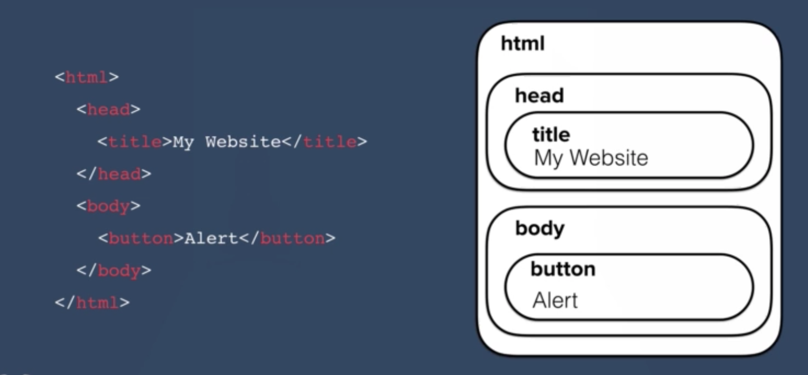
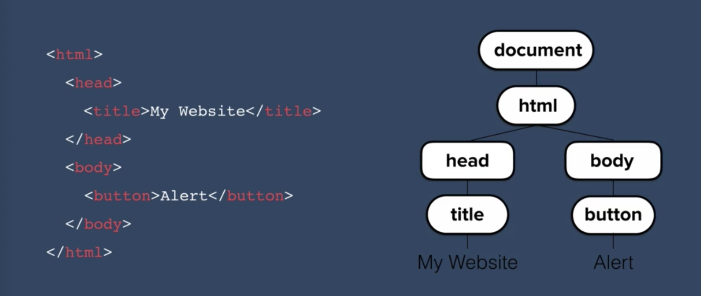
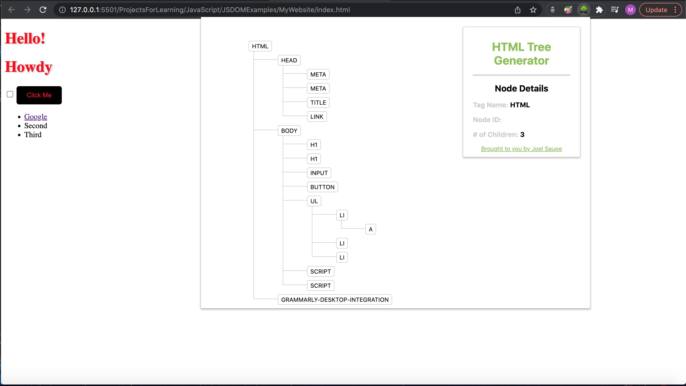

# JavaScript DOM

<hr>

## DOM Overview

Up until this point, most of website have been static. Whenever we open up our webpage, it is static content that is loaded into the browser. This limits how interactive the webpage is, allowing us not to really change parts of the webpage on the fly. In order to do this we need to incorporate javascript within our frontend.

When a user interacts with our HTML content, we will need to respond to said interaction by returning new content or rearranging existing HTML content. This is where the <strong>Document Object Model</strong> come in.

The <strong>DOM</strong> breaks up or HTML content into objects we can select and manipulate with JavaScript code. Lets take a look at the diagram below for further clarification:
<br>

<br>
On the left we have HTML tags that we would use to structure a webpage, on the right we have the hierarchy of the HTML objects. The DOM breaks these objects and their associated data into a tree structure:
<br>

<br>
The relationships of the objects are mapped out by the tree diagram. There is a [chrome extension](https://chrome.google.com/webstore/detail/html-tree-generator/dlbbmhhaadfnbbdnjalilhdakfmiffeg/related?hl=en-US) that generates the tree visualizer for us. This helps us see what the browser sees:
<br>

<br>

<blockquote>Note: the HTML tree is contained inside the Document object.</blockquote>

## Selecting Elements with DOM

Since all html elements are children of the document object (based on the tree diagram), than all we must do is call methods from the document object to gain access to its child object elements.

### firstElementChild

As the name hints, this method is used to return the first element child of whatever object you call it on. For example:

```

// Access the <html> tags
var html = document.firstElementChild;

// Access the <head> tags
var head = html.firstElementChild;

```

### lastElementChild

Similar to the previous method, this method returns the last element child of whatever object it is called on.

```

// Access the <body> tags
var body = document.lastElementChild

```

### querySelector()

Instead of trying to map to the child of each object, you can use <code>querySelector()</code> to access elements by passing in the selector name within the parameters:

```
// Access input elements
var checkbox = document.querySelector("input");
checkbox.click(); // simulate user mouse click

## Manipulating DOM elements

Now that we are able to access and assign content to variables, we can manipulate such content through javascript.

### innerHTML

Using the <code>innerHTML</code> method, we can assign different values to the contents of HTML elements:

```

var heading = document.firstElementChild.lastElementChild.firstElementChild;
heading.innerHTML = "Good Day from JS DOM"; // we change the contents using innerHTML

```

### Attributes

You can also access attributes of html elements by calling on the objects properties, as you normally would in javascript:

```

// Change style of heading
var heading = document.firstElementChild.lastElementChild.firstElementChild;
heading.style.color = "blue";

```

```
