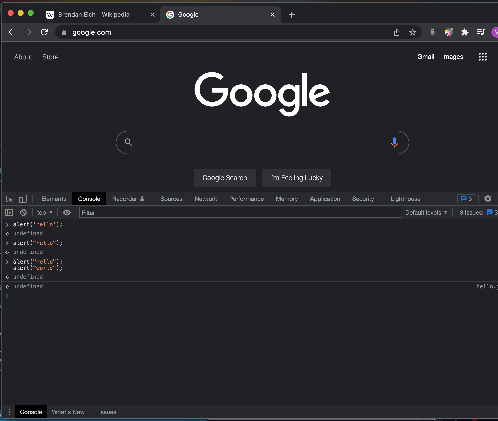
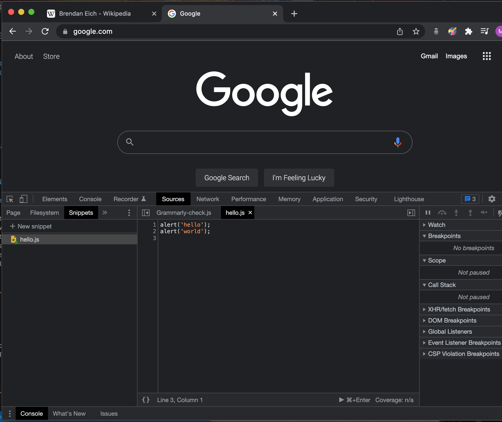
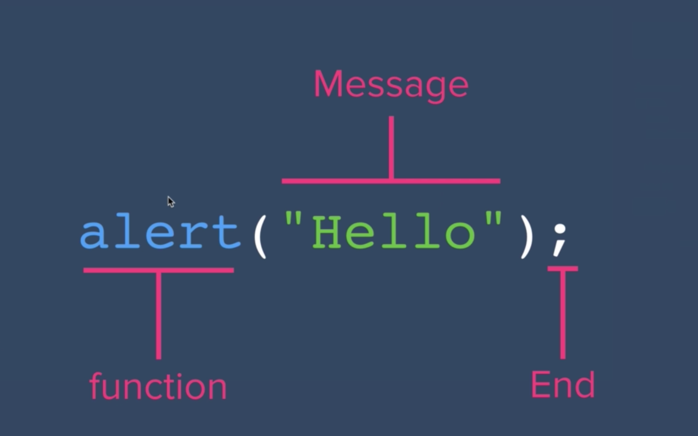
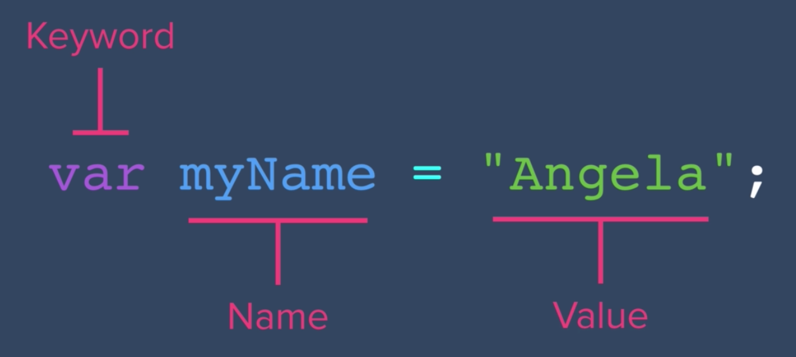

# JavaScript

<hr>

## JavaScript Origins

### History:

The beginning of Javascript came about around the time that the popular 90's internet browser declined in popularity. Netscape envisioned a world where instead of webpages staying as static HTML pages where all calculations, animations and business logic was handled on servers and then returned to the browser for rendering. Netscape saw the need for dynamic webpages where users can interact with the webpage and recieve feedback in real-time. So Netscape contracted [Brendan Eich](https://en.wikipedia.org/wiki/Brendan_Eich) to create a programming language that would add functionality to webpages, all while being simple enough for non-programmers to handle the language. Internet lore says that it took Brendan 10 days to create the Javascript language.

In fact, when javascript was first created, it was called "LiveScript". Then Microsoft felt the need to reverse engineer the language and come up with their own version called "JScript." This led to multiple versions of the Javascript language running on the web. So Europeans tried to standardize the language and created a standard called "ECMAScript," which is what is widely used today. There have been several versions of ECMAScript released, which is what we know as ES5, ES6, ES7 and so on.

### Common Questions:

What does the "Script" in Javascript mean?

- Just like how scripts tell actors what to say and do during a play or film, scripting languages do much of the same thing for web sites. Javascript acts like a script and tells our html elements (our actors in this case) what to do and when to do it.

Java vs Javascript? What is their relationship?

- <blockquote>"Java and Javascript have about as much in common as Car and Carpet."</blockquote> The only reason javascript was called "javascript" was because the word "Java" was a big buzz word in the 90s. They actually have some large differences which you can see below:

<ul>
    <li>
        <h4>Javascript</h4>
        <ul>
            <li>
                Interpreted Language
            </li>
            <li>
                Originally a Frontend Language
            </li>
            <li>
                Supported by all major browsers (chrome, firefox, IE, safari, opera, etc)
            </li>
            <li>
                
            </li>
        </ul>
    </li>
    <li>
        <h4>Java</h4>
        <ul>
            <li>
                Compiled Language
            </li>
            <li>
                Mainly for backend development (now with frontend libraries)
            </li>
        </ul>
    </li>
</ul>

## JavaScript tools in Chrome

### Console:

If you go to your chrome browser, in the top navigation bar under View -> Developer -> Javascript Console, this takes you to the built-in chrome console window where you can test out single lines of javascript at a time. This is great for testing but may not be ideal for testing full programs that require multiple lines of code.


<br>

### Source:

Opposed to the console, the source tab allows for us to create snippets of code within the chrome browser directly. This is a better option than the console if we wish to test out multiple lines of code on the web browser.

<blockquote>Note: Javascript is an interpreter language, so your file will run code line by line until it strikes a line that throws an error or exception.</blockquote>


<br>

## JavaScript Structure

### Commands:



- <strong>Function:</strong> keyword that can be predefined or custom that allows for some form of behavior
- <strong>Message:</strong> In this case, the message is what is displayed in the pop up window. But in another scenario, the message can be a parameter or input for another behavior.
- <strong>End:</strong> The end of the javascript line of code.

### How to write your JavaScript:

There are many different ways to write your code in JS. But if you wish to adhere to syntax that is widely accepted and adopted by many JavaScript professionials, than you should visit [this repo](https://github.com/rwaldron/idiomatic.js). This is a helpful reference for those starting out, as well as those that are more advanced and need a refresher on best JS syntax practices.
<br>

## JavaScript Data Types

### String:

Strings are a data type defined by the double quotes (""). Any text that is within those double quotes will be stored as a <strong>string</strong> data type by your text editor and web browser. It is called a string because it is a "string" of characters.

### Numbers:

Numbers are integers that are stored as a number data type.

### Boolean:

Boolean is a binary data type that represents two values, true or false, 0 or 1, yes or no.

### Typeof:

Using the <code>typeof()</code> command returns the data type of whatever parameter is entered. This useful in debugging and testing your code.

## JavaScript Variables

In programming, we often repeat information several times throughout our program. Rather than repeat pieces of data everytime we wish to use the data, programmers use this thing called <strong>Variables</strong>.

### Var:

<code>var</code> is the keyword used to define a variable (or a container for our data).



Everytime the computer (or the interpreter to be more specific) comes across the keyword "var", it creates a new container or new box with the label we assign after the keyword. Whatever is after the "=" is placed inside the variable with the data type along with it (in the example image, that is a data type of string).

<blockquote>Note: The neat thing about "var" is that you can change the variable value once it has been instantiated.</blockquote>

### Naming Convention:

It is important to be consistent with how we name our variables for best coding practices. It is best practice to give meaningful names to our variables, here are some examples:

- <strong>carColor</strong>: variable name for the color of a car.
- <strong>baseFontSize</strong>: variable name for size of our base font.
- <strong>numOfLives</strong>: variable name for the number of lives for a video game character.

## Javascript Arithmetic

### Modulo:

This is the more complicated form of arithmetic is javascript. The basic concept of this operator is that it returns the <strong>remainder</strong> of the expression. For example:

```
var a = 9 % 6; // Output: 3
var b = 10 % 3; // Output: 1
var c = 15 % 3; // Output: 0
```

### Order of Operations:

In programming, there is an overall rule called <em>precedence</em>. This rule is similar to the rule we all used to follow called PEMDAS, where multiplication and division have "precendence" over addition and subtraction. For example:

```
var cost = 3 + 5 * 2; // Output: 3 + (10) = 13
var cost2 = 3 + (5 * 2) // Same output
```

<br>
<blockquote>Note: You can use parenthesis to help target part of the expression to be computed first.</blockquote>

### Increment/Decrement:

When looking to increment/decrement numerical data types, most would think to add one to the variable, then restate the value of the original variables as such:

```
var x = 5;
x = x + 1; // x = 6
```

In programming, there is the increment and decrement expressions to help simply this process:

```
var x = 5;
x++; // x = 6
x--; // x = 5
```

<blockquote>Note: This increment/decrement expressions are computed at the end of the line of code. So in this example:
```
var x = 3;
var y = x++;
```
The value of y will be 3. This is because the assignment operator is evaluated <strong>before</strong> the x variable is incremented.
</blockquote>

Now say you want to increment/decrement more than one. You can use the "+=" or "-=" operators to increase numerical values by more than one or by another numerical variable:

```
var x = 5;
x += 3; // x = 8
x -= 5; // x = 3

var y = 10;
x += y; // x = 13 (3 += 10 => 13)
```

### Arthmetic Challenge:

Here, the challenge is to calculate how old a dog would be in human years. Here is my approach to the solution:

```

// Ask for the dogs age
var dogAge = prompt("Please enter the age of your dog: ");

// Calculate the dogs age
var humanAge = ((dogAge - 2) \* 4) + 21;

// Return the human age of the dog
alert("Your dog is " + humanAge + " years old in human years!");

```

## Javascript Methods (Strings)

### Length:

The length method return the number of characters that are contained inside the variable. It is important to remember that this is only valid for variables with a <em>string</em> data type.
<br>
Example:

```

// Calculate num of characters left in a tweet
var message = prompt("Please past a message/tweet: ");
var messageLimit = 280;

// Code goes here for concatenation
alert("You have entered " + message.length + " characters and you have " + (messageLimit - message.length) + " characters left!");

```

### Slice:

The <code>slice(x, y)</code> method does what the name implies, it slices strings into individual or segments of characters. The parameters of this method takes in the index of the characters we wish to slice. The first parameter (x) is the starting index, with the following parameter (y) being the last index of the slice you wish to retrieve. Lets look at an example:

```

// Here is our string variable
var name = "Mahmoud Shabana";

// I want to extract the first character of the string:
var firstLetter = name.slice(0, 1); // slice from the 0 index to index 1 exclusive (not including the character in index 1)
// I want to extract second half of name:
var secondHalf = name.slice(8, name.length);

// display slice
console.log(firstLetter);
console.log(secondHalf);

```

<br>

Revising our Twitter Example from earlier:

```

// Whenever you exceed the character limit, slice the message at the character limit

// Calculate num of characters left in a tweet
var message = prompt("Please past a message/tweet: ");
var messageLimit = 280;

// Code goes here for concatenation
alert("Your message:\n" + message.slice(0, messageLimit) + "\n\nYou have entered " + message.length + " characters and you have " + (messageLimit - message.length) + " characters left!");

```

### toUpperCase/toLowerCase:

This changes all the characters in a string to uppercase casing (and vice versa). This can be useful in formatting in web pages as well as formatting in applications in general. It is important to note that this method does not change the casing of the variable it is acting on, it simply prints out the string variable in uppercase. To change the casing permanently, you must reassign the variable with the output of this method.

Example:

```

var name = "Mahmoud";
name.toUpperCase(); // Output: MAHMOUD

console.log(name); // Output: Mahmoud

name = name.toLowerCase();

console.log(name); // Output: mahmoud

```

<br>

Coding Challenge:

```

// Change inputs to capitalized using only what we learned

//1 Create a var that stores the user inputted name
var name = prompt("Please enter your name (any format is fine): ");

//2 Capitalize the first letter of their name
var firstLetter = name.slice(0, 1).toUpperCase();

//3 Set rest of name to lowercase
var restOfName = name.slice(1, name.length).toLowerCase();

//4 Concatenate the capitalized first letter and rest of name
name = firstLetter + restOfName;

//5 Print/return capitalized name
alert("Hello, " + name);

```

## Javascript Functions

A very important concept in all programming languages. A function is a series of instructions packaged into a block of code that can be reused whenever you need those series of instructions to be executed. This makes reusing code increasingly simple when your are working with larger scripts of code.

### Creating a function:

Below you can reference the syntax you need to create a function in javascript:
<br>

```
function myFunc() {
    // whatever instructions of code you want here
    var name = "Mahmoud Shabana";
    alert(name + " says hello from his function!");
}
```

### Calling a function:

When calling a function, you simply write the name of the function and the parameters that were created when you instantiated the function. Based on the example from before, calling a function would look something like this:
<br>

```
// Calling the function 'myFunc'
myFunc(); // executes code inside myFunc()

/** Output:
*   Mahmoud Shabana says hello from his function!
*/
```

### Creating a function with Parameters:

In the examples above, we were creating functions that executed the same block of code everytime it was called, with the same output expected each time. What if we wanted to specify an input to our function to allow for a more specific execution of the code depending on what we input? This is where function parameters come into play. With parameters, we can pass in specifc values to be used within our function, creating more unique execution of the code. Lets take a look at an example:
<br>

```
function getCandyPrice(numOfCandy) {
    const priceOfCandy = 0.50;
    const cost = numOfCandy * priceOfCandy;

    return cost;
}

getCandyPrice(2); // Output: 1
getCandyPrice(10); // Output: 5
getCandyPrice(5); // Output: 2.50
```

Based on the example above, we can calculate the price a bag of candy will be with whatever amount of candy we buy, and have the cost be returned using the <code>return</code> keyword. This will work with any amount as long as the price of each piece of candy is the same.

### Code Challenge:

Find the amount of candy you can buy with a specified amount of money. For example, if the candy costs 2 dollars, and you have 13.50, you can only buy 6 pieces of candy. Here is my solution:

```
function numOfCandy(amountOfMoney) {
    const costOfCandy = 1.50;
    const result = (amountOfMoney - (amountOfMoney % costOfCandy)) / costOfCandy;

    return result;
}
var money = 20;
console.log("You can buy " + numOfCandy(money) + " pieces of candy with $" + money + " dollars!");
```

This function here will take the remainder of the money you have and the cost of the candy. The remainder is subtracted from the total amount of money and divided by the cost of candy. You could have used the floor() method to round down the quotient of the money you have and the price of piece of candy. BUT that is no fun at all!

### Nesting Functions:

Taking what we learned in our previous sections, we can create more complicated functions that help us execute commands more seemlessly. Lets refactor the previous challenge above:
<br>

```
function numOfCandy(amountOfMoney, costOfMoney) {
    const result = (amountOfMoney - (amountOfMoney % costOfCandy)) / costOfCandy;

    return result;
}
```

By creating two parameters, we can pass in different values for the amount of money we have, and how much each piece of candy will cost.
<br>
We can also call functions within functions to execute more instructions without repeating code. Lets look at this example:

```
function tripToCandyStore(money) {
    console.log("Today I got $" + money + " dollars in allowance and want to go to the candy store!");
    console.log("There are two types of candy I can get, chocolate or caramel.");

    var chocolatePrice = 1.50;
    var caramelPrice = 2.50;
    console.log("The price of chocolate is $" + chocolatePrice + " a piece and caramel is $" + caramelPrice + " a piece");

    var chocolateAmount = numOfCandy(money, chocolatePrice);
    var caramelAmount = numOfCandy(money, caramelPrice);

    console.log("With $" + money + " dollars, I can get " + chocolateAmount + " pieces of chocolate or " + caramelAmount + " pieces of caramel.");
}

function numOfCandy(amountOfMoney, costOfMoney) {
    const result = (amountOfMoney - (amountOfMoney % costOfCandy)) / costOfCandy;

    return result;
}

tripToCandyStore(30);
```

Here we can use the <code>numOfCandy()</code> function calculates the amount of candy we instantiated within the <code>tripToCandyStore()</code> function. This helps our code stay DRY (Don't Repeat Yourself).

## JavaScript Random

### Random():

The random method is a part of the <code>math</code> library. This returns a random 16 placed decimal between 0 and 1. This is helpful in generating a (somewhat) random value for our program to determine a random outcome.

```
// using random
const n = Math.random();
console.log(n);

```

its important to remember that computers can never be truly random. So this is considered more of a pseudo-random number generator. To learn more about pseudo-random number generator, visit [here](https://www.youtube.com/watch?v=GtOt7EBNEwQ)

### Coding Challenge (Love Calculator):

Lets create a love calculator where we take in two user inputs and calculate the percentage of their "love" using the random method.

```
console.log("Welcome to the Love Calculator!");

// get user names
var firstUser = prompt("Enter the first user:");
var secondUser = prompt("Enter the second user:");

// calulate random love percentage
var randNum = Math.random();

// set random value between 1 and 100
randNum *= 100;
randNum = Math.round(randNum) + 1;

// return to user
console.log("Between " + firstUser + " and " + secondUser + ", the love connection is " + randNum + "%!");
```

<blockquote>Note: This should be run in the chrome developer tools due to the <code>prompt()</code> command.</blockquote>

## JavaScript Conditionals

In programming, when you want to direct certain tasks to execute depending on the current state of a variable or a value, than you should use something called a <strong>conditional statement</strong>. By evaluating the condition of an expression, you can execute a specific task if its true and other task if it isnt true (or false).
In JavaScript (and most programming languages), you use the <code>if</code> keyword followed by an expression to define a conditional. Here is an example:

```
const number = prompt("Give me a number between 1 and 10 inclusive:");

// check if number is greater than 5
if (number > 5) {
    console.log("your number is greater than five!");
} else {
    // if condition is NOT satified, run this block of code
    console.log("number is less than and equal to five!");
}
```

The term for this is programming is <strong>control flow</strong>. This is because we can literally control the flow of our code depending if certain conditions are met.
<br>
You can also check multiple conditions using the <code>else if</code> keyword. Here is another example:

```
const number = prompt("Give me a number between 1 and 10 inclusive:");

// check if number is greater than 5
if (number > 5) {
    console.log("your number is greater than five!");
} else if (2 < number <= 5) {
    // check another condition if first condition is not met, run this block of code
    console.log("number is between 5 and 2!");
} else {
    console.log("number is either 1 or 2!");
}
```

### Comparators

There are three different ways to check for equality in JavaScript using the "=" sign. 

- "=": This assigns a value to a variable.
- "==": This compares two values regardless of data types.
- "===": this compares two values and their datatypes, both must be equal.

There are also ">", "<", ">=", "<=", and "!=".
