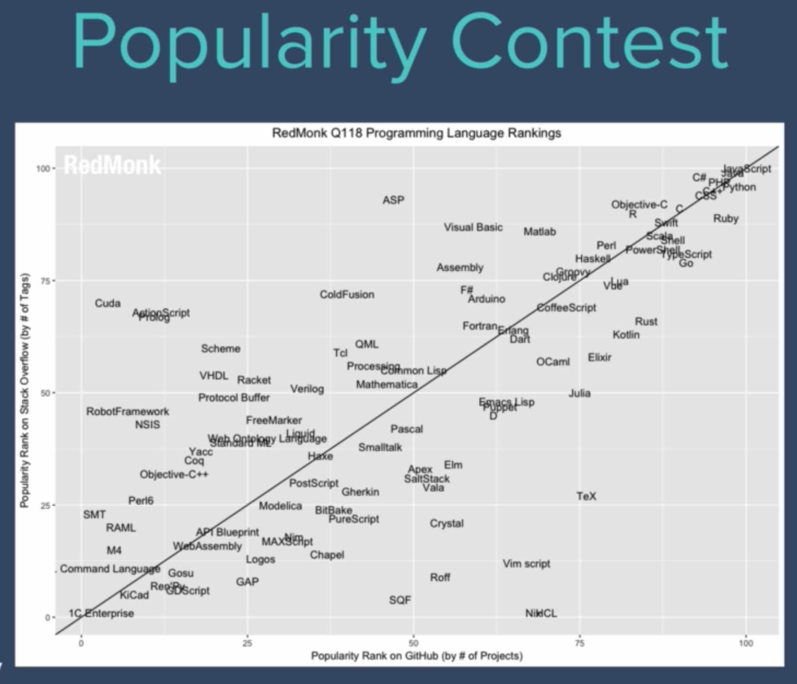

# JavaScript

## JavaScript Origins

### History

The beginning of Javascript came about around the time that the popular 90's internet browser declined in popularity. Netscape envisioned a world where instead of webpages staying as static HTML pages where all calculations, animations and business logic was handled on servers and then returned to the browser for rendering. Netscape saw the need for dynamic webpages where user can interact with the webpage and recieve feedback in real-time. So Netscape contracted [Brendan Eich](https://en.wikipedia.org/wiki/Brendan_Eich) to create a programming language that would add functionality to webpages, all while being simple enough for non-programmers to handle the language. Internet lore says that it took Brendan 10 days to create the Javascript language.

In fact, when javascript was first created, it was called "LiveScript". Then Microsoft felt the need to reverse engineer the language and come up with their own version called "JScript." This led to multiple versions of the Javascript language running on the web. So Europeans tried to standardize the language and created a standard called "ECMAScript," which is what is widely used today. There have been several versions of ECMAScript released, which is what we know as ES5, ES6, ES7 and so on.

### Common Questions

What does the "Script" in Javascript mean?

- Just like how scripts tell actors what to say and do during a play or film, scripting languages do much of the same thing for web sites. Javascript acts like a script and tells our html elements (our actors in this case) what to do and when to do it.

Java vs Javascript? What is their relationship?

- <blockquote>"Java and Javascript have about as much in common as Car and Carpet."</blockquote> The only reason javascript was called "javascript" was because the word "Java" was a big buzz word in the 90s. They actually have some large differences which you can see below:

<ul>
    <li>
        <h4>Javascript</h4>
        <ul>
            <li>
                Interpreted Language
            </li>
            <li>
                Originally a Frontend Language
            </li>
            <li>
                Supported by all major browsers (chrome, firefox, IE, safari, opera, etc)
            </li>
            <li>
                
            </li>
        </ul>
    </li>
    <li>
        <h4>Java</h4>
        <ul>
            <li>
                Compiled Language
            </li>
            <li>
                Mainly for backend development (now with frontend libraries)
            </li>
        </ul>
    </li>
</ul>
